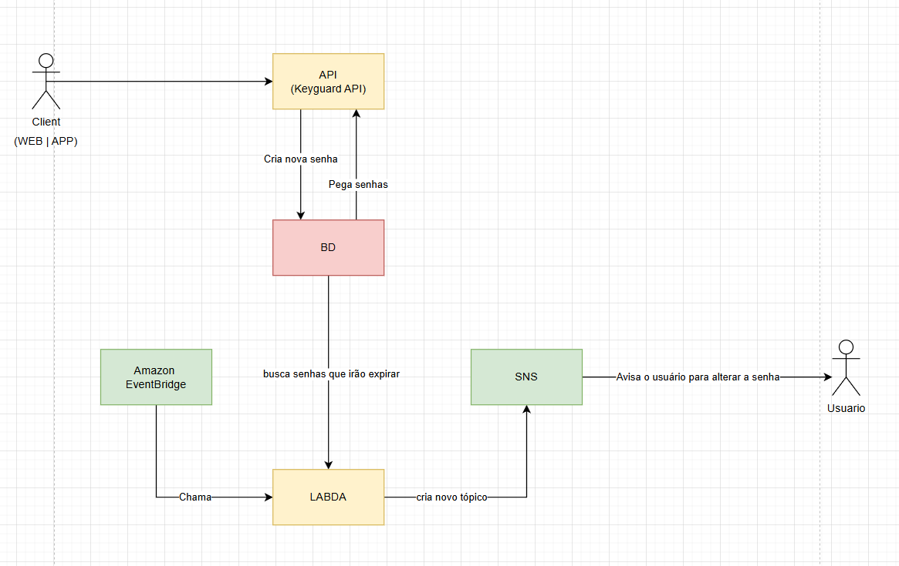

# 🚀 Keyguard API

## 📋 Descrição

Sistema criado com o propósito de armazenas senhas utilizadas no dia-a-dia sendo possível:

- Se registrar 
- Se autenticar
- Criar novas senhas para suas aplicações
- recuperar suas senhas

## ☘️ Arquitetura
 

Este projeto é composto diversar partes

A API foi desenvolvida em Java com SpringBoot e é responsável por realizar as operações com as senhas e mante-las protegidas com a utilização de uma autenticação básica JWT.

A API realiza transações com o banco de dados para armazenar os dados de usuários e suas senhas.

Foi criado tambem um Scheduler Amazon EventBridge que é responsável por chamar uma função lambda da AWS, a qual é responsável por procurar no banco as senhas que estão prestes a expirar, caso encontre, a função cria um novo tópico SNS (Simple Notificação Service).

O SNS é utilizado para enviar as notificações por email para os usuários que estão com suas senhas prestes a expirar, enviando também qual o aplicativo que se encontra nesta condição.

## 📫 Contribuindo

Para contribuir, siga estas etapas:

1. Crie uma branch a partir da branch principal: `git checkout -b <nome_branch>`.
3. Faça suas alterações e confirme-as: `git commit -m '<mensagem_commit>'`
4. Envie para o branch original: `git push origin <nome_branch>`
5. Crie a solicitação de pull.

## 📜 Licença 

Este projeto não está sob nenhuma licença.
